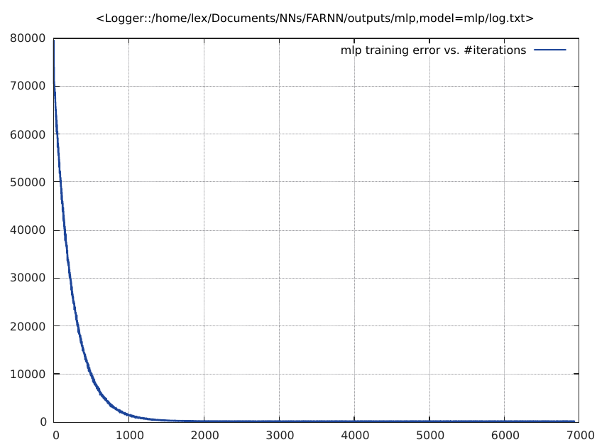
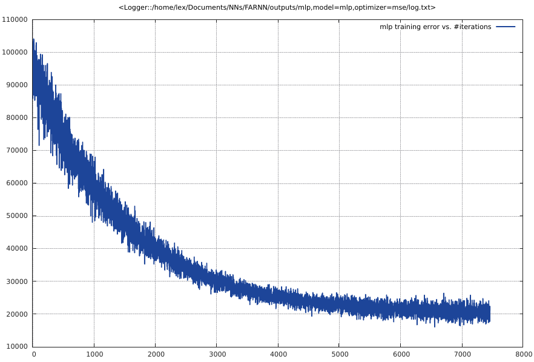
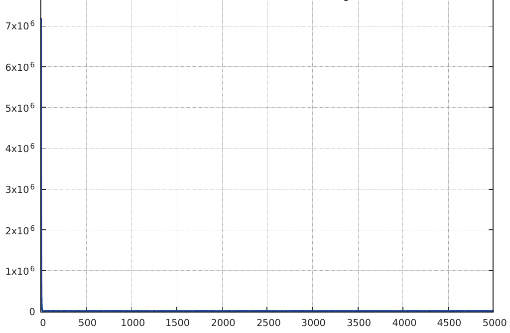
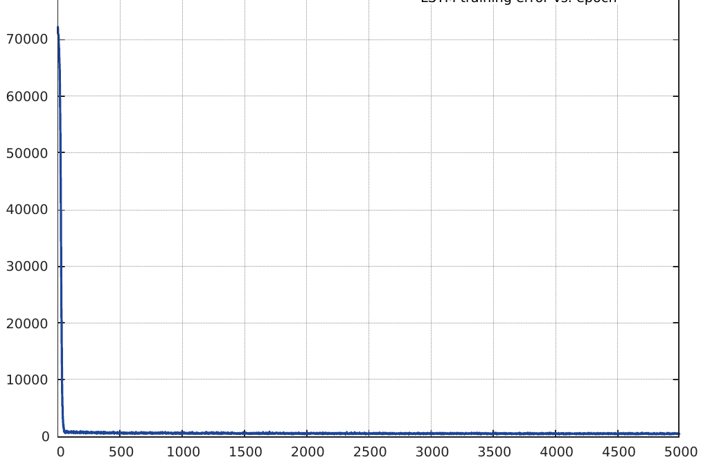
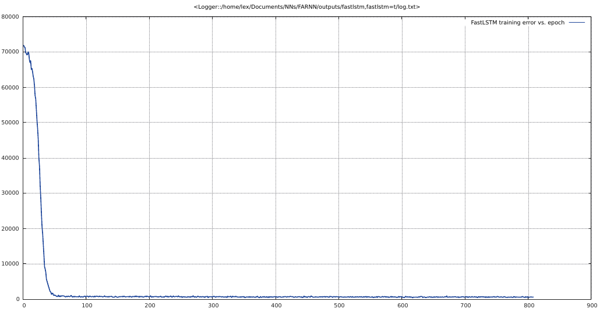
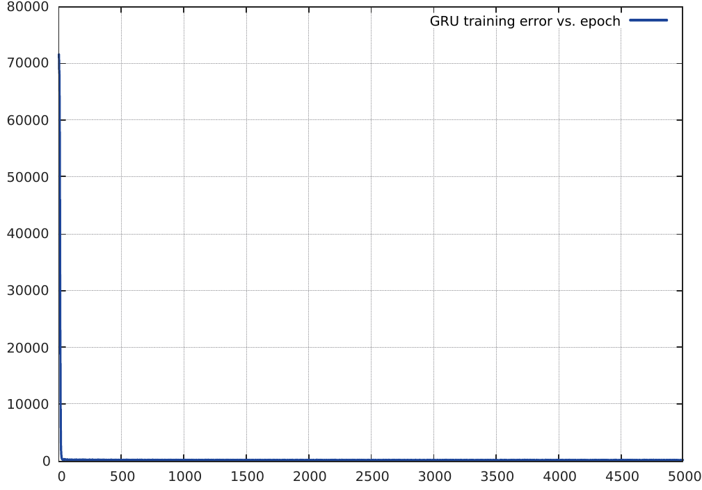
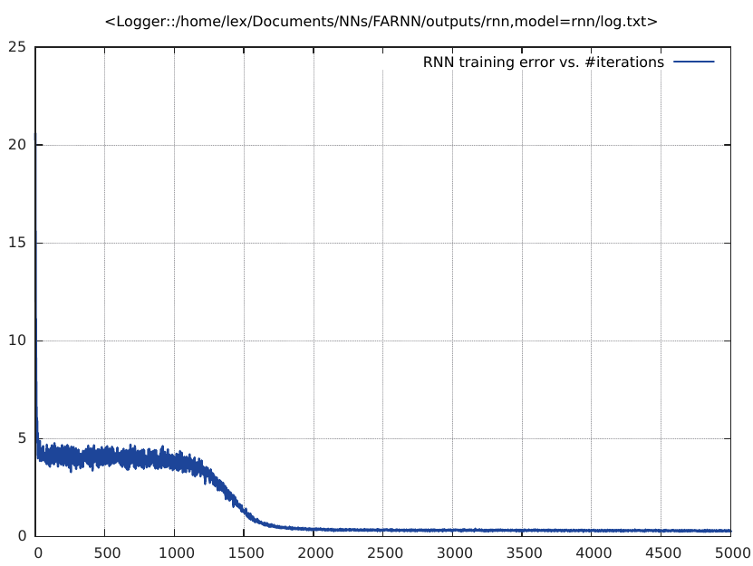
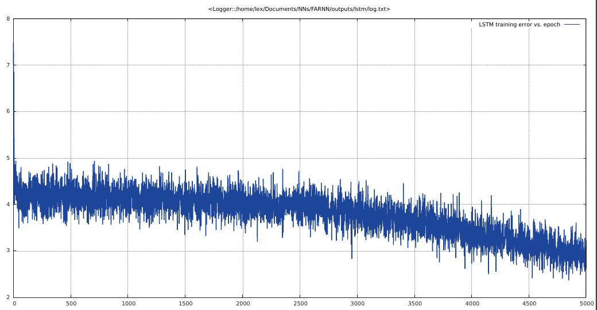
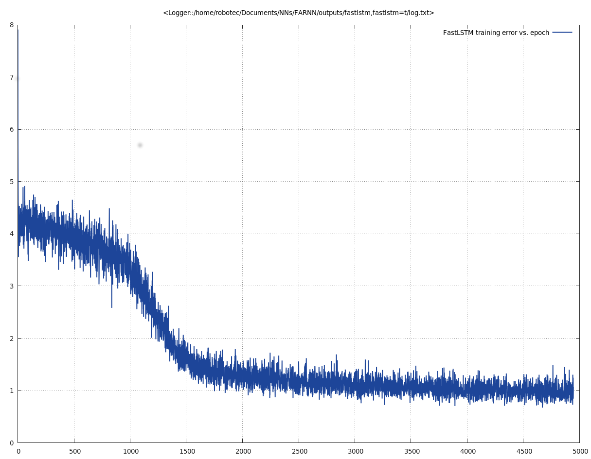

# Soft-Robots DataSet 
### MLP Training: Training with mse on soft robots data

With a learning rate of 1e-4 and using the mlp model on soft robot, mI achieved convergence but training was slow.; important to notice there is no dropout or momentum in this implementation; batchNorm seems pretty useless for this training as the error reduction is not clearly discernible

### Learning rate = 1e-2
Changed learning rate to 1e-2 to see if I could get better convergence but the minimization was zagging round +/- 20 decrease in error

### Learning rate = 1e-3 [th main.lua -data softRobot -model mlp -plot -optimizer mse -batchNorm
]
brought error in first epoch down from 48716.261719 to 129.988235. Sounds like 1e-3 is a good learning rate.

** Number of epochs set to 25 **

** Result for 70 epochs using my MSE minimizer **


The figure above merely maps the pneumatic valve current to the pitch motion of the head. Assuming a coupling of all other twist motion of the human head during bladder actuation, we get the data presented in the chart below



### RNN Model Training
<b> Sept 2, 6:03pm </b>
By cleaning up this code, I got the model to work well with (i) a standalone feedforward mlp and (ii) a feedforward mlp followed by an rnn using a learning rate of 1e-3/1e-4.

I've separated the model constructions to a separate file/module to make the errors easier to spot during training. Changing the set-up to a the twist motion means changing the number of outputs in the dataparser file now. Given my previous strugges in Reading on this project, I've gotta say this is a remarkable achievement.

** Parameters **
If you changed to a SISO model under rnn for the soft Robots data, remember to set the following parameters in dataparser

```lua
	  ninputs     = 1; noutputs    = 1; nhiddens = 1; nhiddens_rnn = 1
```
I found the learning rate of 1e-3 to be optimal for the rnn model

And in `model.lua`, remember to do `neunet = nn.Sequencer(neunet)` rather than `neunet    = nn.Repeater(neunet, noutputs)`. .<a href="#fn1" class="footnoteRef" id="fnref1"><sup>1</sup></a>

** Result for 50 epochs using Element Research Inc.'s rnn minimizer **


## LSTMs

Recurrent networks use their feedback connections to store representations of recent input events in the form of activations (i.e. <i>short-term memory</i> compared against "long-term memory by slowly changing weights.") Such is important for tasks such as speech processingm non-Markovian Control and music composition.

<b>RNN problem:</b> With conventional "Back-propagation Through Time" (e.g. Werbos 1998) or Real Time Recurrent Learning (RTRL) error signals flowing backwards in time tend to either (i) explode or (ii) vanish such that the temporal evolution of the backpropagated error exponentially depend on the size if the weights. With exploding gradients, you could have oscillating weights while for vanishing gradients, learning to bridge long time delays is prohibitively costly in time or never works.

<b>LSTM Remedy:</b> Learning to store information over a long period of time using recurrent backpropagation takes a long period of time, mostly due to lack of adequate and decaying error back floww. LSTM is a gadient-based method that truncates the gradient where it does no harm in the network. An LSTM can learn to bridge minimal time lags in excess of 1000 discrete time steps by enforcing <i>constant error flow </i> through "constant error carousels" within special units. [HochReiter1997](LSTM). Multiplicative gate units learn to open and close access to the constant error flow. LSTM is local in space and time and its computational complexity per time step and weight is $\mathcal{O}(1)$. For long-term delay-infested (:D) systems, LSTMs solves recurrent neural network algorithms faster and better.

LSTMs are designed to avoid the long-term dependency problem that recurrent neural networks are known to have. They are specialists in remembering information for a long period of time. 

LSTMS are recurrent neural network architecture variants that overcome the error back-flow problems by bridging time intervals exceeding 1000 steps even for noisy incomprehensible input sequences without loss if short time lag capabilities. The LSTM architecture enforces constant error flow through the internal states of the special units iff the gradient computation is truncated at certain architecture specific points. LSTMs use multiplicative units as second order nets to protect error flow from unwanted perturbations. To avoid long-term problems of gradient-based learning algorithms, LSTMs are initialized using simple weight-guessing to randomly initialize all network weights until the resulting net is able to correctly classify all the training sequences.While weight-guessing solves many simple tasks, it is not a fool-proof way of solving more complicated tasks which may require many free parameters (e.g. input weights) or high weight precision (e.g. for continuous-valued parameters).

#### Constant error flow: A naive approach
To avoid vanishing error signals, constant error flow through a single unit $j$ with a single connection to itself can be achieved vy setting 

\begin{align}
	{f_j}^'(net_j(k))w_{jj} = 1.0 
\end{align}

in the error back flow if $\theta_j$ given by 

\begin{align}
\theta_j(k) = {f_j}^'(net_j(k)) \theta_j(k+1) w_{jj}
\end{align}

<b>The constant error carousel: </b> Integrating the differential equation above, we have $f_j(net_j(k)) = \frac{net_j(k)}{w_{jj}} for arbitrary net_j(k). This means that $f_j$ has to be linear and unit j's activation has to remain constant:

\begin{align}
y_j(k+1) = f_j(net_j(k+1)) = f_j(w_{jj}y^j(k)) = y^j(k)
\end{align}

In experiments, this is ensured by using the identity function $f_j: f_j(x= = x, \forall x, and by setting w_jj = 1.0. We refer to this as the constant error carousek (CEC). CEC will be LSTM's central feature. )

#### Memory cells and gate units: To 

### Fast LSTM 
<b> Sep 03, 2016 </b>
Use fast lstm with a dropout probability of .35. Three hidden layers each with 1, 10 and 100 neurons respectively.  

Trained for 50 epochs each of `softRobot_lstm-net.t7`, 
`softRobot_fastlstm-net.t7`, `softRobot_gru-net.t7`, `softRobotrnn-net.t7` and 



LSTM Training of soft robot siso model (50 epochs)



Fast LSTM Training of soft robot siso model (50 epochs)

<b>Training of GRU Model on soft robot network </b>



### System integration

Install boost with chrono and thread and then install torch-ros
e.g. First copy bjam from tools/build to /usr/bin and then do the following in order

```bash
	lex@lex:/usr/local/boost_1_61_0$ bjam install libs/chrono libs/thread
	lex@lex:/usr/local/boost_1_61_0$ sudo bjam install --prefix=/usr/local/boost_1_61_0 --with-chrono --with-thread
```

## GlassFurnace Network::September 11, 2016

This is a MIMO dataset that ships with the DaIsY dataset. It is made of three inputs and 6 outputs.

###MLP
The mlp network generalizes well to DaISy MIMO data. I trained for 50 epochs looping over each epoch for 10,000 iterations and using a 3 -> 6 -> 6 network layer. Also, cut out ballbeam/robotArm/soft-robot data from the glassfurnace branch. Training error is described in the graph below:


### RNN Network

Same idea as for soft-robot data. Use 3 input layers in a feedforward structure. Then stack a recurrent layer going back five steps in time on the feedforward; made the output of the recurrent layer 6 as flassfurnace data is MIMO with 3 inputs and six outputs. Same rnnLearningRate as soft-robot data and embed the network in an nn.recurrent model. Noticed a faster convergence to minimum.
Again, we train over 50 epochs looping over each epoch for 10,000 iterations to guarantee global minimum.

Training started at Sun Sep 11 14:10:35 CDT 2016. The training process proceeded as 



Notice RNN first saturates after first 12-some epochs before reducing in slope for a further 13 epochs.

### Standard LSTM

Used a 3 -> 10 -> 100 hidden layer with dropout probability of 35%. Same idea as an mlp and rnn. Train for 50 epochs looping over data 10,000 iterations at each epoch. Operation on training these datas in matlab can ve trial and error of different options in the system identification toolbox et cetera.



Training is rather erratic at first. 

### Fast LSTM
Could not get fast lstm class to work with nngrapgh as it kept complaining from `gModule.lua:348` that it could not split 3 outputs. So I turned off nngrapgh altogether. In the end, the training is not much different from what I have for an LSTM. Here is my network table:

Fast LSTM Network Table
	
nn.Sequencer @ nn.Recursor @ nn.Sequential {
  [input -> (1) -> (2) -> (3) -> (4) -> (5) -> (6) -> (7) -> output]
  (1): nn.FastLSTM(3 -> 3)
  (2): nn.Dropout(0.3, busy)
  (3): nn.FastLSTM(3 -> 10)
  (4): nn.Dropout(0.3, busy)
  (5): nn.FastLSTM(10 -> 100)
  (6): nn.Dropout(0.3, busy)
  (7): nn.Linear(100 -> 6)
}

The training data is available here:



Tuning the learning rate from 1e-3 to 5e-3 after a host of other trials seem to settle the error about the 3.8 to 4.08 valley. Turning on the recurrent batch normalization class in fastLSTM algorithm seemed to speed up trainnhg by a factor of 2. Towards the last five epochs, the lstm seems to have mastered the dynamics in the glassfurnace system by learning bringing down the error to ~0.85 from an original of 4.8. Note that recurrent batch normalization is turned on. This accounts to the normed errors.

<section class="footnotes">
<hr>
	<ol>
		<li id="fn1"><p>This has been fixed in September Week II wherein I separated each system into different branches on my github page<a href="#fnref1">↩</a></p></li>
	</ol>
</section>